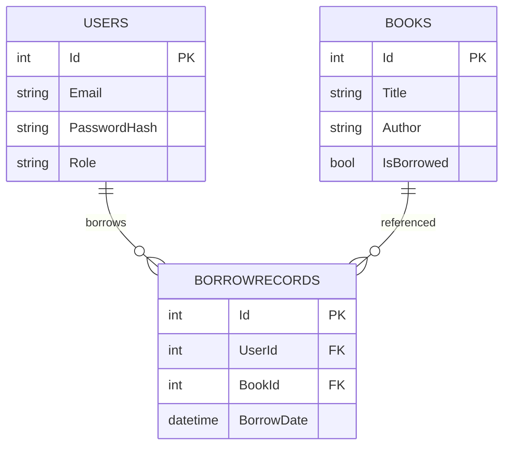

# Database Schema

```mermaid
erDiagram

USERS {
    int Id PK
    string Email
    string PasswordHash
    string Role
}

BOOKS {
    int Id PK
    string Title
    string Author
    bool IsBorrowed
}

BORROWRECORDS {
    int Id PK
    int UserId FK
    int BookId FK
    datetime BorrowDate
}

USERS ||--o{ BORROWRECORDS : borrows
BOOKS ||--o{ BORROWRECORDS : referenced
```
