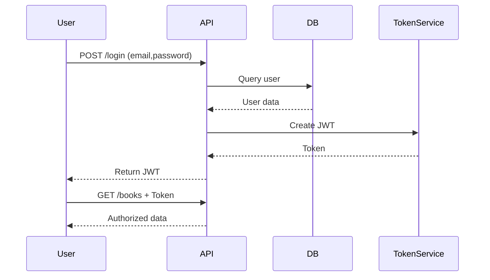

# Login Flow

```mermaid
sequenceDiagram

participant User
participant API
participant DB
participant TokenService

User->>API: POST /login (email,password)
API->>DB: Query user
DB-->>API: User data
API->>TokenService: Create JWT
TokenService-->>API: Token
API-->>User: Return JWT

User->>API: GET /books + Token
API-->>User: Authorized data
```
